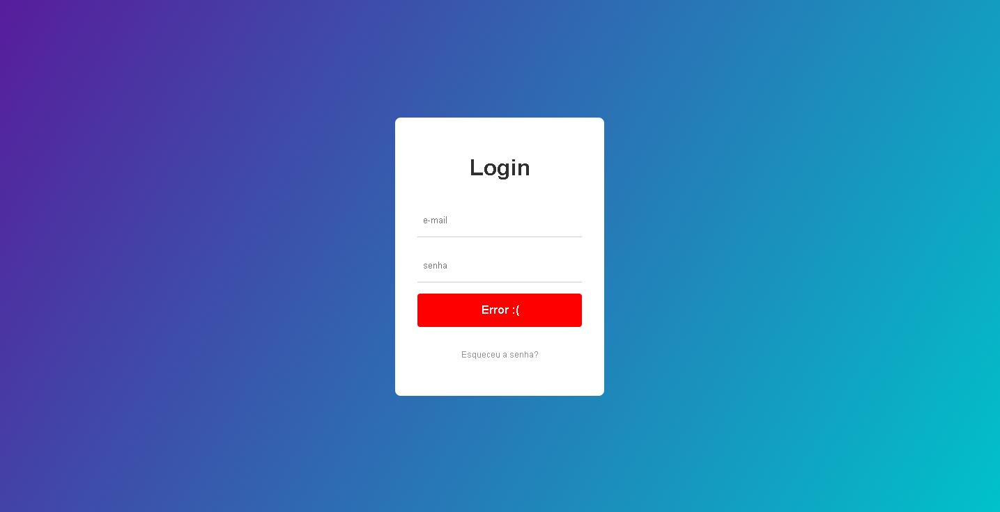

<h2>Página de login</h2>

 Criação de uma página de login

<h2>Sobre o projeto</h2>

 Nesse projeto eu construi uma página de login com animações, validação de input e envio de informações.
  
<h2>Tecnologias Usadas</h2>
<ul>
 <li>HTML</li>
 <li>CSS</li>
 <li>JavaScript e fetch</li>
</ul>

<h2>Ilustrações<h2>
 

